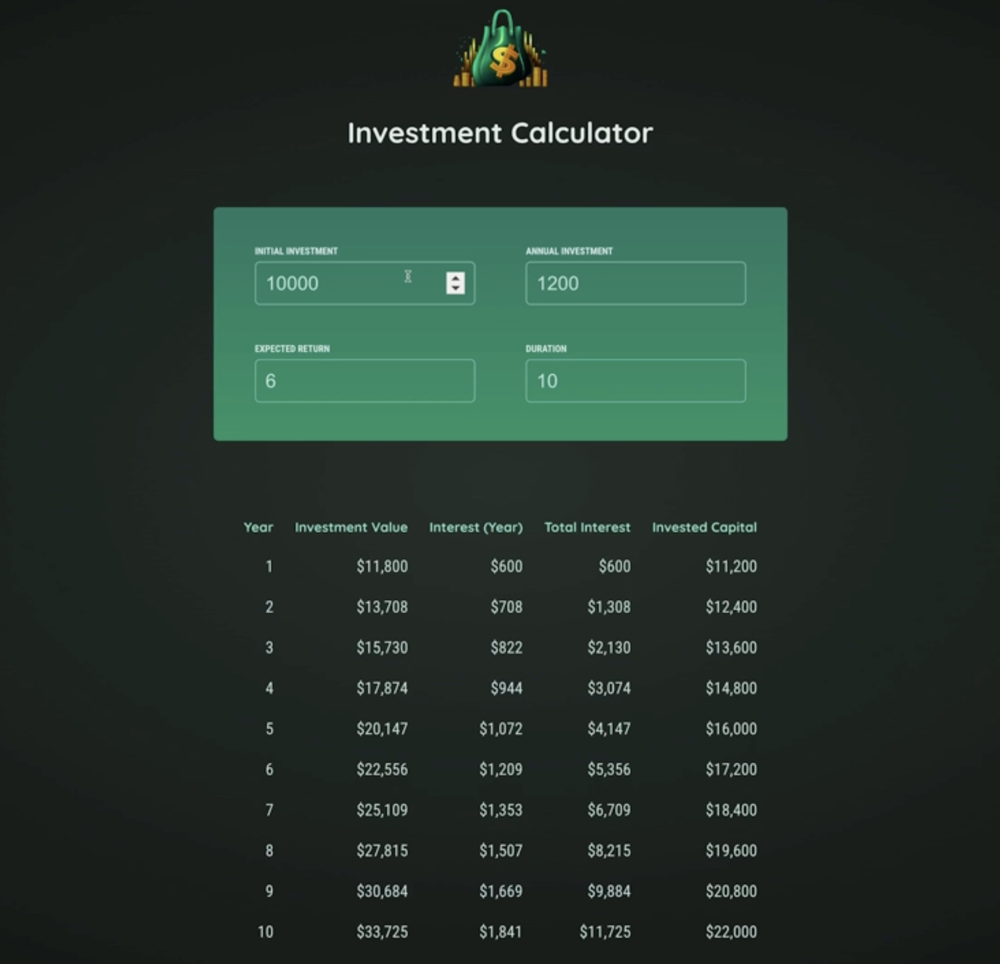

# 💰 Investment Calculator

An elegant **Investment Calculator** built using **React** that helps users estimate their investment growth over time.  
It visualizes how your investment evolves annually, factoring in **initial investment**, **annual contributions**, and **expected return rate**.

---

## Features

- Dynamic calculation of investment growth per year  
- Displays yearly breakdown:  
  - Investment Value  
  - Interest Earned (Yearly & Total)  
  - Invested Capital  
- User input for:
  - Initial Investment
  - Annual Investment
  - Expected Return (in %)
  - Duration (in years)
- Modern responsive UI with a clean design
- Instant updates as you modify inputs

---

## 🖼️ Preview



---

## 🛠️ Tech Stack

- **React**
- **JavaScript (ES6+)**
- **CSS**
- **Responsive Layout** for desktop and mobile

---

## 📦 Installation


   ```bash
   # Clone the repository
   git clone https://github.com/abdullahabdelaziz122/investment-calculator.git
   
   #Navigate to the project directory
   cd investment-calculator

   # Install dependencies
   npm install

   # Run Server
   npm run dev
```

---

## ⚙️ Usage

1. Enter your:

   * Initial investment
   * Annual investment
   * Expected return rate (in %)
   * Duration (in years)
2. The calculator will automatically generate a table showing:

   * Annual investment value
   * Interest gained per year
   * Total interest
   * Total invested capital

